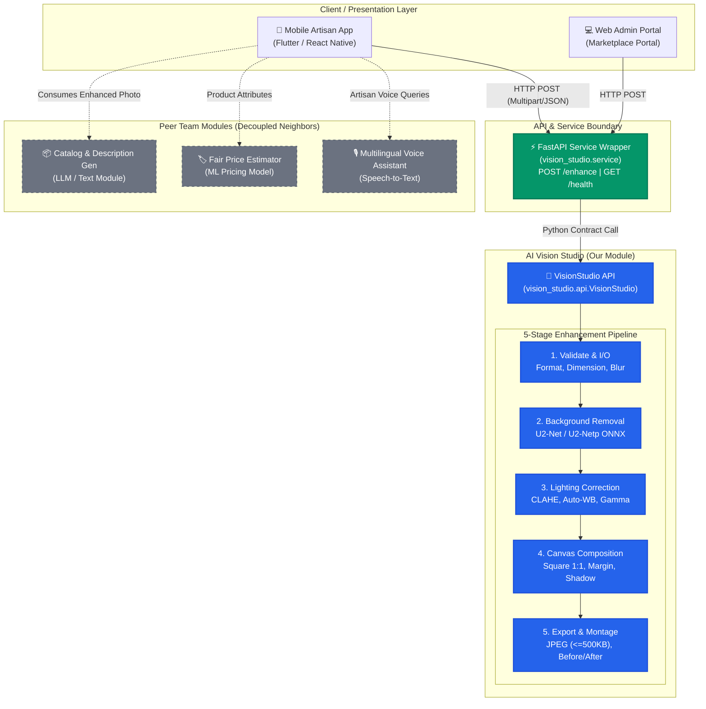
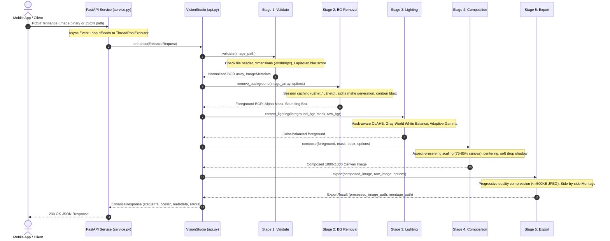

# AI Vision Studio — Architecture & System Design

**Project**: Smart Cataloging & AI-Driven Market Linkage for Marginalized Artisans  
**Problem Statement**: SIH PS 26090  
**Module**: AI Vision & Image Studio (`ai-vision-studio`)  
**Lead Component**: Image enhancement, background removal, lighting correction, standard e-commerce canvas composition.

---

## 1. System Context & Team Integration

The `ai-vision-studio` module operates as an independent, decoupled component within the larger KalaSetu platform. It exposes both a direct Python API and an asynchronous HTTP service interface. External modules (Mobile App, Catalog Generator, Price Estimator) interface exclusively through contract-driven boundaries without direct code dependencies.

---

## 2. Enhancement Pipeline Architecture

The processing pipeline guarantees deterministic transformations for handcrafted goods (textiles, pottery, jewelry, brassware) across 5 stages:

---

## 3. Concurrency & Threading Model

Image processing operations (OpenCV matrix transforms, ONNX Runtime deep learning inference) are CPU-bound and synchronous. To prevent blocking the asynchronous FastAPI event loop:

- **Async Offloading**: Invocations of `studio.enhance(req)` are scheduled via `asyncio.get_running_loop().run_in_executor(None, studio.enhance, req)`.
- **Worker Threadpool**: Worker threads execute inference in parallel across available CPU cores.
- **Model Session Caching**: ONNX inference sessions for `u2net` and `u2netp` are instantiated as singletons per model type, preventing repeated weight allocation.
- **Timeout Protection**: The internal pipeline is wrapped in a configurable wall-clock timeout (`request_timeout_s=20.0`) using daemon worker execution.

---

## 4. API & Contract Boundary

The module boundary is strictly governed by [vision_studio/contracts.py](file:///c:/Users/Preetam/Desktop/KalaSetu/ai-vision-studio/vision_studio/contracts.py):

| Contract | Field | Type | Description |
|---|---|---|---|
| **EnhanceRequest** | `contract_version` | `str = "1.0"` | API contract schema version |
| | `image_path` | `str` | Absolute path to local image file |
| | `options` | `EnhanceOptions` | Fine-tuning knobs and quality profile |
| **EnhanceOptions** | `remove_background` | `bool = True` | Enable/disable AI background segmentation |
| | `correct_lighting` | `bool = True` | Enable/disable lighting and color normalization |
| | `output_size` | `tuple[int, int] = (1000, 1000)` | Final canvas width and height |
| | `background_color` | `str = "#FFFFFF"` | Target canvas background color (HEX) |
| | `quality` | `Literal["fast", "balanced", "high"]` | Processing profile selector |
| **EnhanceResponse** | `contract_version` | `str = "1.0"` | API contract schema version |
| | `status` | `Literal["success", "partial", "error"]` | Overall processing status |
| | `processed_image_path` | `str \| None` | Path to final enhanced product image |
| | `metadata` | `dict` | Execution metrics, stage latencies, image dims |
| | `errors` | `list[dict]` | Structured errors and warnings |

---

## 5. Deployment Modes

1. **Direct Python Import**: Embedded directly inside a desktop or backend Python script (`from vision_studio import VisionStudio, EnhanceRequest`).
2. **FastAPI Web Service**: Headless HTTP daemon (`uvicorn vision_studio.service:app --port 8000`) for mobile and cloud backend communication.
3. **Dockerized Microservice**: Containerized deployment (`docker run -p 8000:8000 vision-studio`) with pre-warmed weights.
